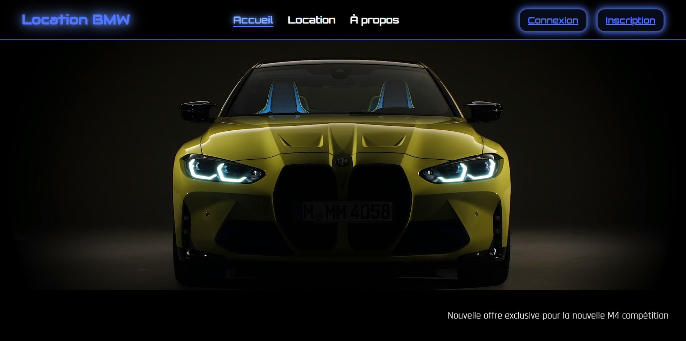

# Projet SAE : Site Web BMW

## Description du Projet
Ce projet consiste en la création d'un site web dédié à BMW, ma passion. Le site est réalisé dans le cadre de ma SAE (Situation d'Apprentissage et d'Évaluation). L'objectif est de concevoir un site web attractif, accessible, et respectant les normes actuelles du web. 

## Contenu du Site

### Pages
1. **Page d'accueil** :

   - Une présentation visuelle captivante de l'univers BMW.

   - Un contenu informatif pour introduire le sujet du site.

   - Mise en avant d'une vidéo de haute qualité.

2. **Page pour découvrir certains modèles de BMW** :

   - Présentation des modèles emblématiques de BMW (exemple : BMW M4 Compétition, BMW Série 4, ix1).

   - Une section sur les performances, technologies et innovations de chaque modèle.

3. **Page "À propos"** :

   - Présentation de l'auteur du site (moi-même).

   - Mon intérêt pour BMW et ma passion pour le design web.
   
4. **Pages de connexion et inscription** :

   - Formulaire de connexion pour les utilisateurs déjà inscrits(il n'y a pas de base de données, par conséquent non fonctionnelle).

   - Formulaire d'inscription permettant aux nouveaux utilisateurs de créer un compte(il n'y a pas de base de données, par conséquent non fonctionnelle).

   - Validation des champs (email, mot de passe, etc.) pour garantir une expérience utilisateur fluide et sécurisée.

### Techniques Utilisées
- **HTML et CSS** :

  - Code validé via les outils W3C (HTML et CSS).

  - Respect des standards du Web.

- **Flexbox et CSS Grid** :

  - Organisation et mise en page des éléments pour un rendu clair et structuré.

- **Responsive Design** :

  - Adaptation pour une visualisation optimale sur mobile, tablette et ordinateur.

- **Accessibilité (WCAG 2.0 AA)** :

  - Alternatives textuelles pour les images et les vidéos.

  - Navigation accessible au clavier pour les utilisateurs malvoyants.

### Animations CSS
- plusieurs animations pour enrichir l'expérience utilisateur :
  - Exemple : Animation au survol sur les titres ou images.
  - Effets de transition sur les boutons.

## Déploiement et Versioning
- **GitHub Repository** :
  - Le code source est hébergé sur un repository GitHub public.
  - Les commits sont fréquents et utilisent un nommage descriptif en majorité (exemple : `Ajout-animation-titre-accueil`).

- **GitHub Pages** :
  - Le site est accessible publiquement via GitHub Pages.
  - Lien vers le site (photo cliquable) :
   

## Technologies Utilisées
- **HTML**
- **CSS**
- **Flexbox**
- **CSS Grid**
- **Git/GitHub**
- **GitHub Pages**

## Auteur
**Maxence Canival**

- Étudiant en 1ème année BUT Réseaux et Télécommunications, option Cybersécurité.
- Passionné par le développement web.
- Contact : maxence.canival@etu.unicaen.fr

---
Merci de visiter ce projet. Vos retours sont les bienvenus pour m'aider à améliorer mes compétences et enrichir ce site !
